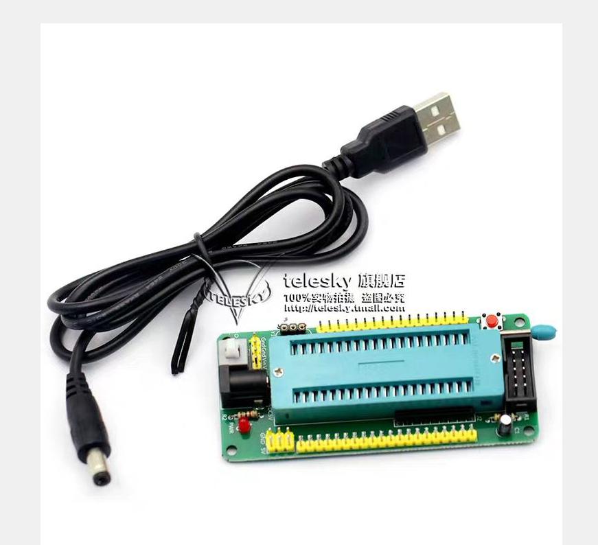
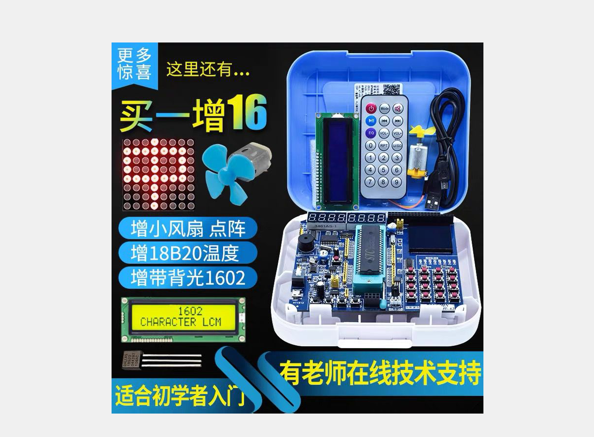
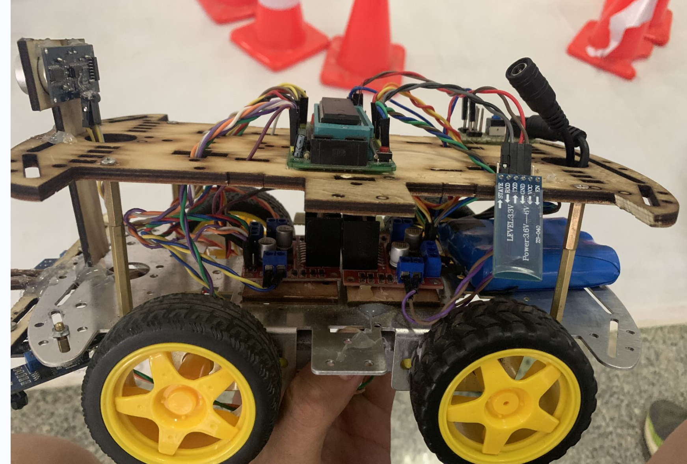
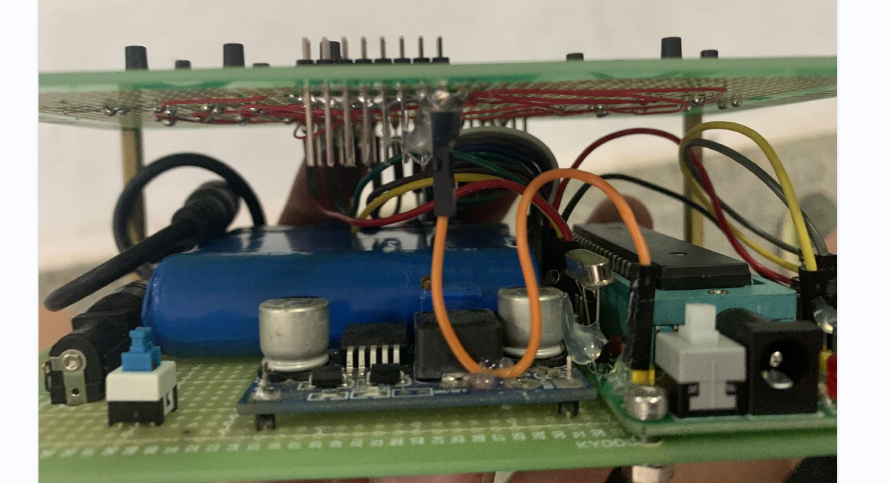
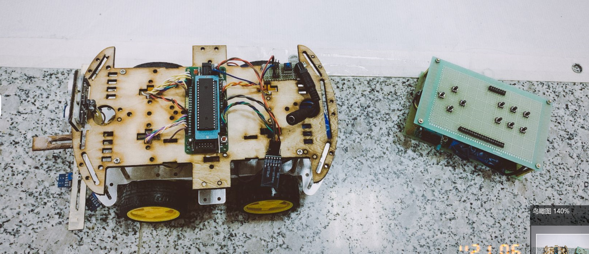

# 单片机

将CPU芯片、存储器芯片、I/O接口芯片和简单的I/O设备（小键盘、LED显示器）等装配在一块印刷电路板上，再配上监控程序（固化在ROM中），就构成了一台单板微型计算机（简称单片机）。
单片机在一片集成电路芯片上集成微处理器、存储器、I/O接口电路，从而构成了单芯片微型计算机，即单片机。
Intel公司推出了MCS-51系列单片机：集成 8位CPU、4K字节ROM、128字节RAM、4个8位并口、1个全双工串行口、2个16位定时/计数器。寻址范围64K，并有控制功能较强的布尔处理器。

CPU：由运算和控制逻辑组成，同时还包括中断系统和部分外部特殊功能寄存器；

RAM：用以存放可以读写的数据，如运算的中间结果、最终结果以及欲显示的数据；

ROM ： 用以存放程序、一些原始数据和表格；

I/O口：四个8位并行I/O口，既可用作输入，也可用作输出；51单片机在一上电时，如果我们没有认为的控制其I/O口的状态，它所有未控制的I/O口都将默认为高电平。

T/C：两个定时/记数器，既可以工作在定时模式，也可以工作在记数模式；

·一个全双工UART（通用异步接收发送器）的串行I/O口，用于实现单片机之间或单片机与微机之间的串行通信；
· 片内振荡器和时钟产生电路，石英晶体和微调电容需要外接。最高振荡频率取决于单片机型号及性能。

单片机总结：
无论哪种芯片，观察其表面，大都会有凹进去的小圆坑，或者是用颜色标识的小标记（圆点或小三角或其他小图形），这个标记所对应的引脚就是这个芯片的第1引脚，然后逆时针方向数下去，即1 到最后一个引脚。
40个引脚暗器功能类别将其分为三类：
·电源和时钟引脚。如Vcc、GND、XTAL1、XTAL2
·编程控制引脚。
·I/O口引脚。如P0、P1、P2、P3，4组8位I/O口

```c
//Vcc（40脚）、GND（20脚）——单片机电源引脚，常压为+5V，低压为+3.3V。
//XTAL1（19脚）、XTAL2（18脚）——外接时钟引脚。XTAL1为片内振荡电路的输入端，XTAL2为输出端
//RST——单片机的复位引脚，当输入连续两个机器周期以上高电平时为有效，复位后程序计数器PC=0000H。
//ALE/PROG(Pin30)：地址锁存允许信号
//PSEN(Pin29)：外部存储器读选通信号
//EA/VPP(Pin31)：程序存储器的内外部选通，接低电平从外部程序存储器读指令，如果接高电平则从内部程序存储器读指令。
```

P0口——内部没有上拉电阻，为高阻状态，所以不能正常的输出高/低电平，因此改组I/O口使用时必要外接上拉电阻，一般我们选择接入10千欧的上拉电阻。

# 关于电平特性：

数字电路中只有两种电平：高和低
（本课程中）定义单片机为TTL电平：
高 +5V 低 0V
RS232电平：计算机的串口
高 -12V 低+12V
所以计算机与单片机之间通讯时需要加电平转换芯片max232
或者转换器（USB转TTL串口线）。

# 最小系统能够运行起来的必要条件。

1.电源 2.晶振 3.复位电路
对单片机任意IO口的随意操作
1.输出控制电平高低 2.输出检测电平高低。
定时器：重点掌握几种常用的方式
中断：外部中断、定时器中断、串口中断
串口通信：单片机之间、单片机与计算机间

## C51数据类型扩充定义：

Sbit——特殊功能位声明，也就是声明某一个特殊功能寄存器中的某一位。
由电阻标号认知阻值：
例如：103表示阻值大小为10 * 10^3欧，即10千欧
150表示15 * 10^0欧即15欧

## 发光二极管：

具有单向导电性，通过5mA左右电流即可发光，电流越大，亮度越强。一般控制在3~20mA之间。当发光二极管发光时，测量其两端电压，这个电压又叫做发光二极管的“导通压降”。
74HC573锁存器
OE（低电平有效）通常叫做输出使能端，在设计电路时必须将OE接低电平，因此将其全部接地。因此当他为低电平的时候， 锁存器开始工作。
VCC和GND为电源和地端。
LE为锁存端，当LE为高电平的时候，Q0~ Q7都跟D0~ D7状态一样，当LE为低电平的时候，Q0~ Q7都锁存数据，无论D0~ D7怎么变化，Q0~Q7都保持锁存之前的那个状态。

# **单片机的几个周期介绍：**

1. 时钟周期。也称振荡周期，定义为时钟频率的倒数。他是单片机中最基本的，最小的时间单位。时钟频率越高，单片机的工作速度就越快。
2. 状态周期。是时钟周期的两倍。
3. 机器周期。单片机的基本操作周期，由12个时钟周期（6个状态周期）组成。
4. 指令周期。

## 数码管

数码管内部有8个小的发光二极管，最后还有一个公共端。而他们的公共端又可分为共阳极和共阴极。对共阴极数码来说，其8个发光二极管的阴极在数码管内部全部连接在一起，所以称为“共阴”，而他们的阳极是独立的。
在数码管程序中，在每次送完段选数据后，在送入位选数据之前，需要加上一句“P0 = 0xff”，这条语句的专业名词叫做“消影”。在送完段选数据后，P0口仍然保持着上次的段选数据，加上“消影”后，在开启位选锁存器后，P0口数据全为高电平，所以哪个数码管都不会亮，因此这个“消影”动作是很重要的。

## 按键

键盘分为编码键盘和非编码键盘，非编码键盘又分为独立键盘和行列式（矩阵式）键盘。
单片机检测按键的原理：单片机的I/O口既可以作为输入也可以作为输出使用，当检测按键时用的是它的输入功能，我们把按键的一端接地，另一端与单片机的某个I/O口相连，开始时先给该I/O口赋一高电平，然后让单片机不断的检测该I/O口是否变为低电平，当按键闭合时，即相当于该I/O口通过按键与地相连，变成低电平，程序一旦检测到I/O口变为低电平则说明按键被按下，然后执行相应的指令。

**什么是中断？暂停正在进行的程序去处理内部随机发生的事件。因规定时间已到，或者计数已满引起的中断**。


## 定时器：

51定时器的定时原理就是二进制加一计数器，利用计数周期相同的脉冲（时钟脉冲）实现定时。

## 计数器：

当输入的外部脉冲信号发生从1到0的负跳变时，计数器的值就自动加1。检测一个从1到0的下降沿需要2个机器周期，因此要求被采样的电平至少要维持一个机器周期。
脉冲来源：系统的时钟振荡器输出脉冲经12分频，T0或T1引脚输入的外部脉冲源。

## 中断

51单片机内部有五个中断源的中断控制系统；
52单片机一共有6个中断源，他们的符号，名称及产生的条件分别解释如下：
·INT0——外部中断0，由P3.2端口线引入，低电平或下降沿引起。
·INT1——外部中断1，由P3.3端口线引入，低电平或下降沿引起。
·T0——定时器/计数器0中断，由T0计数器记满回零引起。
·T1——定时器/计数器1中断，由T1计数器记满回零引起。
·T2——定时器/计数器2中断，由T2计数器记满回零引起。
·TI/RI——串行口中断，串行端口完成一帧字符发送/接收后引起。
以上6个中断源中，T2是52单片机特有的。

```c

单片机在使用中断功能时，通常需要设置两个与中断有关的寄存器：中断允许寄存器IE和中断优先级寄存器IP。

中断允许寄存器用来设定各个中断源的打开与关闭，IE在特殊功能寄存器中，字节地址为A8H，该寄存器可以进行按位寻址，单片机复位时IE全部被清0。

中断优先级寄存器在特殊功能寄存器中，字节地址为B8H，IP用来设定各个中断源属于两级中断中的哪一级，该寄存器可以进行按位寻址，单片机复位时IE全部被清0。

在51单片机系列中，高优先级中断能够打断低优先级中断以形成中断嵌套，同优先级中断之间或低级对高级中断则不能形成中断嵌套。若几个同级中断同时向CPU请求中断响应，在没有设置中断优先级情况下，按照默认终端级别响应中断，在设置中断优先级后，则按设置顺序确定响应的先后顺序。

单片机的定时器中断：
51单片机内部共有两个16位可编程的定时器/计数器，即定时器T0和定时器T1。52单片机多一个T2

定时器/计数器的实质是加1计数器（16位），由高8位和低8位两个寄存器组成。TMOD是定时器/计数器的工作方式寄存器，确定工作方式和功能；TCON是控制寄存器，控制T0，T1的启动和停止及设置溢出标志。

定时/计数器实质上是一个加1计数器。它随着计数器的输入脉冲进行自加1，也就是每来一个脉冲，计数器就自动加1，当加到计数器为全1时，再输入一个脉冲就使计数器回零，且计数器的溢出使相应的中断标志位置1，向CPU发出中断请求（定时/计数器中断允许时）。如果定时/计数器工作于定时模式，则表示定时时间已到；如果工作于计数模式，则表示计数值已满。

可见，由溢出时计数器的值减去计数初值才是加1计数器的计数值。
51单片机定时/计数器最大可计 2^16=65536个数。（0——65535）

定时/计数初始值的确定：
定时器/计数器计满之后溢出，向CPU申请中断。因此定时器的初值X为计数器计数的最大值（65536）与需要计几个数N之间的差值。

时钟周期：晶振振荡周期 T时钟=1/f晶振
机器周期：计数器/定时器加一的时长
机器周期=12*时钟周期（12M晶振单片机T机器=1us）
计数状态 X=65536-N
定时状态 X=65536-需要定的时间/机器周期。
所以定50ms，定时器初值应为65536-50000。

设置为定时器模式时，加1计数器是对内部机器周期计数（一个机器周期等于12个振荡周期，即计数频率为晶振频率的1/12）.计数值N乘以机器周期Tcy就是定时时间t。

单片机在使用定时器或计数器功能时，通常需要设置两个与定时器有关的寄存器：定时器/计数器工作方式寄存器TMOD与定时器/计数器控制寄存器TCON。
```

# C51 题目

一、选择题。
1、80C51系列是（B  ）位CPU的单片机。
A)4 B)8 C)16 D)32
2、十进制数126其对应的十六进制可表示为（ D）。
A)0x8f B)0x8e C)0xfe D)0x7e
3、对于外部中断0，若采用电平触发方式，则需要（ D）。
A)IE0=1 B)IT0=1 C)IE0=0 D)IT0=0
4、关于定时器，若振荡频率为12MHz，在方式1下最大定时时间为（B ）。
A)8.192ms B)65.536ms C)0.256ms D)16.384ms
5、在中断响应后必须用软件清零的是（ B）。
A)TF1 B)TI C)IE1 D)TF0
6、下列说法正确的是（  A）。
A)定时器工作方式2可在计数器计满时自动装入初值
B)定时器工作方式2是16位计数器
C)定时器工作方式2是8位计数器，所以相当于增加了一个额外的8位计数器
D)定时器工作方式2是13位计数器
7、当外部中断请求的信号方式为跳沿触发方式时,要求中断请求信号的低电平状态应至少维持(  B)。
A)1个时钟周期 B)1个机器周期 C)1个状态周期 D)1个晶振周期
8、MCS-51单片机的外部中断1的中断请求标志是(D  )。
A) ET1 B) TF1 C) IT1 D) IE1
9、定时/计数器的工作方式有（ A ）寄存器的内容决定。
A)TMOD B)TCON C)TR0 D)SCON
10,定时器1溢出后将对（  A）标志置1。
A)IT1 B)TR1 C)TF1 D)TR0
11、下列关于定时器叙述正确的是（ C）。
A)TH0和TL0均为16位寄存器
B)TH0寄存器存放计数值的低8位，TH1寄存器存放计数值的高8位
C)TH0寄存器存放计数值的高8位，TL0寄存器存放计数值的低8位
D)TH0和TL0须为相同的值
12、单片机应用程序般存放在(B )中。
A)RAM B)ROM C)寄存器 D)CPU
13堆栈指针SP的作用是（ C）。
A)存放运算结果
B)存放各标志位
C)指向栈顶元素
D)指向栈底元素
二、填空题。
1、请写出共阳极一位数码管显示A~F的编码： 0x88，0x83，0xc6，0xa1，0x86，0x8e 。

2、对MCS-51单片机时序，每个机器周期包括 12 个时钟周期；每个指令周期至少包括 1 个机器周期；每个状态周期包括 2 个时钟周期；每个机器周期由 6 个状态周期组成；如果采用8MHz晶振，1个机器周期为__ 1.5us ，如何计算 1/8M * 12 = 1.5 us 。

3、MCS-51系列单片机有 5 个中断源， 2 个优先级，在同一优先级下，中断源的响应顺序分别是 INT0 、T0 、INT1 、T1、UART 。

4、如果要使用外部中断1，且选择下降沿触发方式，该如何初始化：

EA=l;
EX1=1;
IT1=1;

5、如果要使用定时器1，且选择工作方式1，当系统采用12MHz晶振时，若要定时器定时50ms，该如何初始化：

TMOD=0x10;
TH1=(65536-50000)/256;
TL1=(65536-50000)%256;
EA=l;
ET1=1;
TR1=1;

6、请简述51单片机复位的作用及复位方式：

答：①复位的作用：单片机对相关的寄存器、I/O 端口进行初始化操作，使单片机从初始状态开始工作，复位是解决智能化设备故障（防止程序卡死或跑飞）的首选操作。
②复位的方式：上电复位和按键复位；使RST 引脚输入不少于2个机器周期的高电平。 

请简述为什么完成一次中断后，CPU能精确的返回到断点继续执行主程序，它是怎样实现这个过程的。

答：CPU响应中断时会先把当前指令的下一条指令，就是中断返回后将要执行的指令的地址断点（PC值）地址送入堆栈，中断返回后再取出断点的地址，原主程序得以继续往下执行。


7. C语言同意一些令人震惊的结构,下面的结构是合法的吗，如果是它做些什么？ 

   ```C
int a = 5, b = 7, c; 
   
   c = a+++b;
   
   ```
   
   














