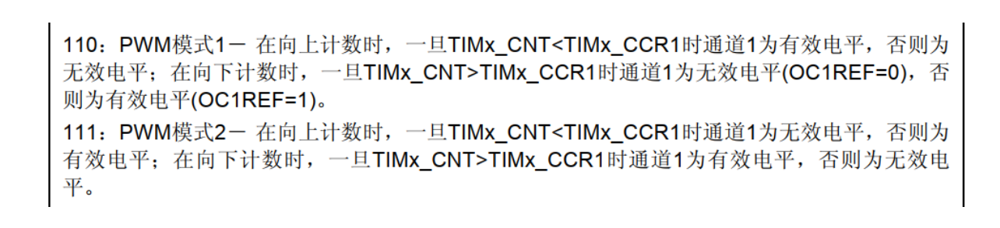

# stm32F4 

## 中断

### 外部中断

```c


1 在main中 设置“中断分组”
     中断分组： 0，1，2，3，4，
     例： NVIC_PriorityGroupConfig(NVIC_PriorityGroup_2);
       分组2，2位 抢占优先级（0<=x<=3），2位 响应优先级 （0<=x<3）;数越小，级别越高
2     RCC_APB2PeriphClockCmd(RCC_APB2Periph_SYSCFG, ENABLE);
           使能SYSCFG时钟
   
3    GPIO口初始化，所用引脚口初始化(pE4)
               GPIO_Init();

4 	     设置IO口与中断线的映射关系。
        void SYSCFG_EXTILineConfig(EXTI_PortSourceGPIOE,EXIT_PinSource4);

5   	初始化线上中断，设置触发条件等。           EXTI_Init(&~);
        首先定义一个结构体类型的成员变量，
             EXIT_InitTypeDef   EXIT_InitStrut; // 程序开始

			 EXIT_InitStrut.EXIT_Line= EXIT_Line4//哪一条中断线
             EXIT_InitStrut.EXTI.EXIT_LineCmd=ENABLE  //是否使能
             EXIT_InitStrut.EXIT_Mode= EXIT_Mode_Interrupt  //模式（中断，事件）
             EXIT_InitStrut.EXIT_Trigger=EXIT_Trigger_Falling//触发方式（上升沿触发，下降沿触发，边沿触发）
                 
			EXTI_Init( &EXIT_InitStrut);

6 		              NVIC_Init(&~); // 初始化中断优先级

			NVIC_InitTypeDef   NVIC_InitStrue;    // 程序开头
			 NVIC_InitStrue.NVIC_IRQChannel=EXTI4_TRQn;//中断通道
                 	 NVIC_InitStrue.NVIC_IRQChannelcmd=ENABLE;  // 通道使能
                  NVIC_InitStrue.NVIC_IRQChannelPreemptionPriority=1//抢占优先级
                 NVIC_InitStrue.NVIC_IRQChannelSubPriority=1//响应优先级
   			 NVIC_Init(&NVIC_InitStruce);
		

7   中断服务函数 
    void EXTI4_TRQHandle(void)
{
    
    
}


```


中断分组


引脚口映射：


中断服务函数


```c
// 外部中断

// main.c
	NVIC_PriorityGroupConfig(NVIC_PriorityGroup_2);//设置系统中断优先级分组2
	EXTIX_Init();       //初始化外部中断输入 

// exit.c
	
//外部中断初始化程序
//初始化PE2~4,PA0为中断输入.
void EXTIX_Init(void)
{
	NVIC_InitTypeDef   NVIC_InitStructure;
	EXTI_InitTypeDef   EXTI_InitStructure;
	
	KEY_Init(); //按键对应的IO口初始化
 
	RCC_APB2PeriphClockCmd(RCC_APB2Periph_SYSCFG, ENABLE);//使能SYSCFG时钟
	
 
	SYSCFG_EXTILineConfig(EXTI_PortSourceGPIOE, EXTI_PinSource2);//PE2 连接到中断线2
	SYSCFG_EXTILineConfig(EXTI_PortSourceGPIOE, EXTI_PinSource3);//PE3 连接到中断线3
	SYSCFG_EXTILineConfig(EXTI_PortSourceGPIOE, EXTI_PinSource4);//PE4 连接到中断线4
	SYSCFG_EXTILineConfig(EXTI_PortSourceGPIOA, EXTI_PinSource0);//PA0 连接到中断线0
	
  /* 配置EXTI_Line0 */
    // 配置外部中断条件
  EXTI_InitStructure.EXTI_Line = EXTI_Line0;//LINE0
  EXTI_InitStructure.EXTI_Mode = EXTI_Mode_Interrupt;//中断事件
  EXTI_InitStructure.EXTI_Trigger = EXTI_Trigger_Rising; //上升沿触发 
  EXTI_InitStructure.EXTI_LineCmd = ENABLE;//使能LINE0
  EXTI_Init(&EXTI_InitStructure);//配置

   // 中断优先级 
  NVIC_InitStructure.NVIC_IRQChannel = EXTI0_IRQn;//外部中断0
  NVIC_InitStructure.NVIC_IRQChannelPreemptionPriority = 0x00;//抢占优先级0
  NVIC_InitStructure.NVIC_IRQChannelSubPriority = 0x02;//子优先级2
  NVIC_InitStructure.NVIC_IRQChannelCmd = ENABLE;//使能外部中断通道
  NVIC_Init(&NVIC_InitStructure);//配置
    
    
    
	/* 配置EXTI_Line2,3,4 */
       // 配置外部中断条件
    
``EXTI_InitStructure.EXTI_Line = EXTI_Line2 | EXTI_Line3 | EXTI_Line4;
  EXTI_InitStructure.EXTI_Mode = EXTI_Mode_Interrupt;//中断事件
  EXTI_InitStructure.EXTI_Trigger = EXTI_Trigger_Falling; //下降沿触发
  EXTI_InitStructure.EXTI_LineCmd = ENABLE;//中断线使能
  EXTI_Init(&EXTI_InitStructure);//配置

	    // 中断优先级 
    
  NVIC_InitStructure.NVIC_IRQChannel = EXTI2_IRQn;//外部中断2
  NVIC_InitStructure.NVIC_IRQChannelPreemptionPriority = 0x03;//抢占优先级3
  NVIC_InitStructure.NVIC_IRQChannelSubPriority = 0x02;//子优先级2
  NVIC_InitStructure.NVIC_IRQChannelCmd = ENABLE;//使能外部中断通道
  NVIC_Init(&NVIC_InitStructure);//配置
    
``NVIC_InitStructure.NVIC_IRQChannel = EXTI3_IRQn;//外部中断3
  NVIC_InitStructure.NVIC_IRQChannelPreemptionPriority = 0x02;//抢占优先级2
  NVIC_InitStructure.NVIC_IRQChannelSubPriority = 0x02;//子优先级2
  NVIC_InitStructure.NVIC_IRQChannelCmd = ENABLE;//使能外部中断通道
  NVIC_Init(&NVIC_InitStructure);//配置
	
  NVIC_InitStructure.NVIC_IRQChannel = EXTI4_IRQn;//外部中断4
  NVIC_InitStructure.NVIC_IRQChannelPreemptionPriority = 0x01;//抢占优先级1
  NVIC_InitStructure.NVIC_IRQChannelSubPriority = 0x02;//子优先级2
  NVIC_InitStructure.NVIC_IRQChannelCmd = ENABLE;//使能外部中断通道
  NVIC_Init(&NVIC_InitStructure);//配置
	   
}


//外部中断0服务程序
void EXTI0_IRQHandler(void)
{
	delay_ms(10);	//消抖
	if(WK_UP==1)	 
	{
		BEEP=!BEEP; //蜂鸣器翻转 
	}		 
	 EXTI_ClearITPendingBit(EXTI_Line0); //清除LINE0上的中断标志位 
}	
//外部中断2服务程序
void EXTI2_IRQHandler(void)
{
	delay_ms(10);	//消抖
	if(KEY2==0)	  
	{				 
   LED0=!LED0; 
	}		 
	 EXTI_ClearITPendingBit(EXTI_Line2);//清除LINE2上的中断标志位 
}
//外部中断3服务程序
void EXTI3_IRQHandler(void)
{
	delay_ms(10);	//消抖
	if(KEY1==0)	 
	{
		LED1=!LED1;
	}		 
	 EXTI_ClearITPendingBit(EXTI_Line3);  //清除LINE3上的中断标志位  
}
//外部中断4服务程序
void EXTI4_IRQHandler(void)
{
	delay_ms(10);	//消抖
	if(KEY0==0)	 
	{				 
		LED0=!LED0;	
		LED1=!LED1;	
	}		 
	 EXTI_ClearITPendingBit(EXTI_Line4);//清除LINE4上的中断标志位  
}
	   

// exit,h

/*下面的方式是通过直接操作库函数方式读取IO*/
#define KEY0 		GPIO_ReadInputDataBit(GPIOE,GPIO_Pin_4) //PE4
#define KEY1 		GPIO_ReadInputDataBit(GPIOE,GPIO_Pin_3)	//PE3 
#define KEY2 		GPIO_ReadInputDataBit(GPIOE,GPIO_Pin_2) //PE2
#define WK_UP 	    GPIO_ReadInputDataBit(GPIOA,GPIO_Pin_0)	//PA0


```

### 定时器中断

 F4 定时器种类：

1.高级控制定时器：TIM1,TIM8 （四个通道）

2.通用定时器:TIM2-TIM5,（4个通道）TIM9-TIM14（2个通道）

3.基本定时器：TIM6,TIM7 (无通道)

```c

// 定时器中断，没有通道的概念

// main.c    TIM3  通用定时器 

	NVIC_PriorityGroupConfig(NVIC_PriorityGroup_2);//设置系统中断优先级分组2
	TIM3_Int_Init(5000-1,8400-1);	
   //定时器时钟84M，分频系数8400，所以84M/8400=10Khz的计数频率，计数5000次为500ms    
   //1兆赫（MHz 106 Hz）＝1 000 000 Hz。
   //定时器时钟原84mHZ ,分频系数8400(psc) ，得计数频率为：84M/8400=10000hz
   //计数周期为1/10000=0.1ms，  要计5000(arr)次， 总用时 500ms,即为中断周期

//timer.c
   

//通用定时器3中断初始化
//arr：自动重装值。
//psc：时钟预分频数
//定时器溢出时间计算方法:Tout=((arr+1)*(psc+1))/Ft   us.   
//Ft=定时器工作频率,单位:Mhz  
//这里使用的是定时器3!     // 每溢出一次，执行一次中断函数
void TIM3_Int_Init(u16 arr,u16 psc)
{
	TIM_TimeBaseInitTypeDef TIM_TimeBaseInitStructure;
	NVIC_InitTypeDef NVIC_InitStructure;
	
	RCC_APB1PeriphClockCmd(RCC_APB1Periph_TIM3,ENABLE);  ///使能TIM3时钟
	
  TIM_TimeBaseInitStructure.TIM_Period = arr; 	//自动重装载值  
	TIM_TimeBaseInitStructure.TIM_Prescaler=psc;  //定时器分频
	TIM_TimeBaseInitStructure.TIM_CounterMode=TIM_CounterMode_Up; //向上计数模式
	TIM_TimeBaseInitStructure.TIM_ClockDivision=TIM_CKD_DIV1; 
	
	TIM_TimeBaseInit(TIM3,&TIM_TimeBaseInitStructure);//初始化TIM3
	
	TIM_ITConfig(TIM3,TIM_IT_Update,ENABLE); //允许定时器3更新中断
	TIM_Cmd(TIM3,ENABLE); //使能定时器3
	
	NVIC_InitStructure.NVIC_IRQChannel=TIM3_IRQn; //定时器3中断
	NVIC_InitStructure.NVIC_IRQChannelPreemptionPriority=0x01; //抢占优先级1
	NVIC_InitStructure.NVIC_IRQChannelSubPriority=0x03; //子优先级3
	NVIC_InitStructure.NVIC_IRQChannelCmd=ENABLE;
	NVIC_Init(&NVIC_InitStructure);
	
}

//定时器3中断服务函数
void TIM3_IRQHandler(void)
{
	if(TIM_GetITStatus(TIM3,TIM_IT_Update)==SET) //溢出中断
	{
		LED1=!LED1;//DS1翻转
	}
	TIM_ClearITPendingBit(TIM3,TIM_IT_Update);  //清除中断标志位
}


//time.h
    
		void TIM3_Int_Init(u16 arr,u16 psc);


```


## 复用


```c


//1 首先,我们要使用 IO 复用功能外设，必须先打开对应的 IO 时钟  复用功能外设时钟。如：

/*使能 GPIOA 时钟*/
RCC_AHB1PeriphClockCmd(RCC_AHB1Periph_GPIOA,ENABLE); 
/*使能 USART1 时钟*/
RCC_APB2PeriphClockCmd(RCC_APB2Periph_USART1,ENABLE);


// 2其次，
//我们在 GIPOx_MODER 寄存器中将所需 IO配置为复用功能（若是复用ADC 或 DAC外设，则设置为模拟功能）。再次,我们还需要对 IO 口的其他参数，例如类型，上拉/下拉以及输出速度。
//上面两步，在我们库函数中是通过 GPIO_Init 函数来实现的，参考代码如下：


/*GPIOA9 与 GPIOA10 初始化*/

 GPIO_InitStructure.GPIO_Pin = GPIO_Pin_9 | GPIO_Pin_10; 
 GPIO_InitStructure.GPIO_Mode = GPIO_Mode_AF;//复用功能
 GPIO_InitStructure.GPIO_Speed = GPIO_Speed_50MHz;//速度 50MHz
 GPIO_InitStructure.GPIO_OType = GPIO_OType_PP; //推挽复用输出
 GPIO_InitStructure.GPIO_PuPd = GPIO_PuPd_UP; //上拉
 GPIO_Init(GPIOA,&GPIO_InitStructure); 


// 3 最后，我们配置 GPIOx_AFRL 或者 GPIOx_AFRH 寄存器，将 IO 连接到所需的 AFx。
//这些步骤对于我们使用库函数来操作的话，是调用的 GPIO_PinAFConfig 函数来实现的。具体操作代码如下

/*PA9 连接 AF7，复用为 USART1_TX */
GPIO_PinAFConfig(GPIOA,GPIO_PinSource9,GPIO_AF_USART1); 
/* PA10 连接 AF7,复用为 USART1_RX*/
GPIO_PinAFConfig(GPIOA,GPIO_PinSource10,GPIO_AF_USART1);


// 4    使能打开I/O时钟和复用功能对应外设时钟对应的函数，不同总线下，有不同的使能函数

void RCC_AHB1PeriphClockCmd(uint32_t RCC_AHB1Periph, FunctionalState NewState);
void RCC_AHB2PeriphClockCmd(uint32_t RCC_AHB2Periph, FunctionalState NewState);
void RCC_AHB3PeriphClockCmd(uint32_t RCC_AHB3Periph, FunctionalState NewState);
void RCC_APB1PeriphClockCmd(uint32_t RCC_APB1Periph, FunctionalState NewState);
void RCC_APB2PeriphClockCmd(uint32_t RCC_APB2Periph, FunctionalState NewState);

//我们的串口 1 是挂载在APB2 总线之下，所以我们调用对应的 APB2 总线下外设时钟使能函数 //RCC_APB2PeriphClockCmd来使能串口 1 时钟。对于其他外设我们调用相应的函数即可


```


## 看门狗

### 独立看门狗

```c

// main.c
     IWDG_Init(4,500); //与分频数为64,重载值为500,溢出时间为1s	

		if(KEY_Scan(0)==WKUP_PRES)//如果WK_UP按下,则喂狗
		{
			IWDG_Feed();//喂狗
		}


//iwdg.c
   	
//初始化独立看门狗
//prer:分频数:0~7(只有低3位有效!)   
//rlr:自动重装载值,0~0XFFF.
//分频因子=4*2^prer.但最大值只能是256!
//rlr:重装载寄存器值:低11位有效.
//复位倒计时 时间计算(大概):Tout=((4*2^prer)*rlr)/32 (ms)

void IWDG_Init(u8 prer,u16 rlr)
{
	IWDG_WriteAccessCmd(IWDG_WriteAccess_Enable); //使能对IWDG->PR IWDG->RLR的写
	//取消寄存器写保护
	
	IWDG_SetPrescaler(prer); //设置IWDG分频系数

	IWDG_SetReload(rlr);   //设置IWDG装载值

	IWDG_ReloadCounter(); //reload  喂狗  重新装载将rlr加载到寄存器
	
	IWDG_Enable();       //使能看门狗
}
    

	//喂独立看门狗
void IWDG_Feed(void)
{
	IWDG_ReloadCounter();//reload
}


```


### 窗口看门狗

```c
//main.c
    
    	NVIC_PriorityGroupConfig(NVIC_PriorityGroup_2);//设置系统中断优先级分组2
        WWDG_Init(0x7F,0X5F,WWDG_Prescaler_8); 	//计数器值为7f,窗口寄存器为5f,分频数为8	   
// wwdg.c
    //保存WWDG计数器的设置值,默认为最大. 
u8 WWDG_CNT=0X7F;
//初始化窗口看门狗 	
//tr   :T[6:0],计数器值   初值
//wr   :W[6:0],窗口值     上窗口值 
//fprer:分频系数（WDGTB）,仅最低2位有效 
//Fwwdg=PCLK1/(4096*2^fprer). 一般PCLK1=42Mhz

void WWDG_Init(u8 tr,u8 wr,u32 fprer)
{
 
	NVIC_InitTypeDef NVIC_InitStructure;
	RCC_APB1PeriphClockCmd(RCC_APB1Periph_WWDG,ENABLE); //使能窗口看门狗时钟
	
	WWDG_CNT=tr&WWDG_CNT;   //初始化WWDG_CNT.    取的是tr的低7位
	WWDG_SetPrescaler(fprer); //设置分频值
	WWDG_SetWindowValue(wr); //设置窗口值
	WWDG_Enable(WWDG_CNT);  //开启看门狗
    
	NVIC_InitStructure.NVIC_IRQChannel=WWDG_IRQn; 				 //窗口看门狗中断
	NVIC_InitStructure.NVIC_IRQChannelPreemptionPriority=0x02;  //抢占优先级为2
	NVIC_InitStructure.NVIC_IRQChannelSubPriority=0x03;			//子优先级为3
	NVIC_InitStructure.NVIC_IRQChannelCmd=ENABLE;       	  //使能窗口看门狗
	NVIC_Init(&NVIC_InitStructure);
	
	WWDG_ClearFlag();//清除提前唤醒中断标志位
  WWDG_EnableIT();//开启提前唤醒中断
}


//窗口看门狗中断服务程序 
void WWDG_IRQHandler(void)
{
	WWDG_SetCounter(WWDG_CNT); //重设窗口看门狗值
	WWDG_ClearFlag();//清除提前唤醒中断标志位
	LED1=!LED1;
}

// wwdg.h

    void WWDG_Init(u8 tr,u8 wr,u32 fprer);


```

## 按键

```c
//main.c
    KEY_Init();

   if(KEY_Scan(0)==WKUP_PRES)//如果WK_UP按下
		{
			//执行函数
		}
    
// key.c
   
//按键初始化函数
void KEY_Init(void)
{
	
	GPIO_InitTypeDef  GPIO_InitStructure;

  RCC_AHB1PeriphClockCmd(RCC_AHB1Periph_GPIOA|RCC_AHB1Periph_GPIOE, ENABLE);
    //使能GPIOA,GPIOE时钟
 
  GPIO_InitStructure.GPIO_Pin = GPIO_Pin_2|GPIO_Pin_3|GPIO_Pin_4;
    //KEY0 KEY1 KEY2对应引脚
  GPIO_InitStructure.GPIO_Mode = GPIO_Mode_IN;//普通输入模式
  GPIO_InitStructure.GPIO_Speed = GPIO_Speed_100MHz;//100M
  GPIO_InitStructure.GPIO_PuPd = GPIO_PuPd_UP;//上拉
  GPIO_Init(GPIOE, &GPIO_InitStructure);//初始化GPIOE2,3,4
	
  GPIO_InitStructure.GPIO_Pin = GPIO_Pin_0;//WK_UP对应引脚PA0
  GPIO_InitStructure.GPIO_PuPd = GPIO_PuPd_DOWN ;//下拉
  GPIO_Init(GPIOA, &GPIO_InitStructure);//初始化GPIOA0
 
} 
//按键处理函数
//返回按键值
//mode:0,不支持连续按;1,支持连续按;
//0，没有任何按键按下
//1，KEY0按下
//2，KEY1按下
//3，KEY2按下 
//4，WKUP按下 WK_UP
//注意此函数有响应优先级,KEY0>KEY1>KEY2>WK_UP!!
u8 KEY_Scan(u8 mode)
{	 
	static u8 key_up=1;//按键按松开标志
	if(mode)key_up=1;  //支持连按		  
	if(key_up&&(KEY0==0||KEY1==0||KEY2==0||WK_UP==1))
	{
		delay_ms(10);//去抖动 
		key_up=0;
		if(KEY0==0)return 1;
		else if(KEY1==0)return 2;
		else if(KEY2==0)return 3;
		else if(WK_UP==1)return 4;
	}else if(KEY0==1&&KEY1==1&&KEY2==1&&WK_UP==0)key_up=1; 	    
 	return 0;// 无按键按下
}

///////////key.h

#ifndef __KEY_H
#define __KEY_H	 
#include "sys.h" 	 

/*下面的方式是通过直接操作库函数方式读取IO*/
#define KEY0 		GPIO_ReadInputDataBit(GPIOE,GPIO_Pin_4) //PE4
#define KEY1 		GPIO_ReadInputDataBit(GPIOE,GPIO_Pin_3)	//PE3 
#define KEY2 		GPIO_ReadInputDataBit(GPIOE,GPIO_Pin_2) //PE2
#define WK_UP 	GPIO_ReadInputDataBit(GPIOA,GPIO_Pin_0)	//PA0


/*下面方式是通过位带操作方式读取IO*/
/*
#define KEY0 		PEin(4)   	//PE4
#define KEY1 		PEin(3)		//PE3 
#define KEY2 		PEin(2)		//P32
#define WK_UP 	    PAin(0)		//PA0
*/


#define KEY0_PRES 	1
#define KEY1_PRES	2
#define KEY2_PRES	3
#define WKUP_PRES   4

void KEY_Init(void);	//IO初始化
u8 KEY_Scan(u8);  		//按键扫描函数	

#endif


```

## ADC

```c


```


## PWM

### 通用定时器pwm控制舵机

```c

// main.c

int main(void)
{   
	delay_init(168);  //初始化延时函数    
 	TIM2_PWM_Init(200-1,8400-1);	//84M/8400/200=50hz  . 此处的200就是计数器的比较值 e.g.175/200*20ms=17.5ms（pwm1 极性低）（低电平时间）    得脉冲宽度：20ms-17.5ms=2.5ms
   // pwm各路频率相同， p频率为=84mhz/(psc+1)/(arr+1)
    while(1)
	{
 		delay_ms(1000);	 
		TIM_SetCompare1(TIM2,175);	//修改比较值，修改占空比对应180度   2.5ms 180度
       
		delay_ms(1000);	 
		TIM_SetCompare1(TIM2,180);	//修改比较值，修改占空比对应180度    2ms   145度
		
		delay_ms(1000);	 
		TIM_SetCompare1(TIM2,185);	//修改比较值，修改占空比对应180度     1.5ms  90 
		
        delay_ms(1000);	 
		TIM_SetCompare1(TIM2,190);	//修改比较值，修改占空比对应180度    1ms    45度
		
        delay_ms(1000);	        
		TIM_SetCompare1(TIM2,195);	//修改比较值，修改占空比对应180度      0.5 ms   0度
	}
}

// pwm.c   stm32f4

//TIM2 PWM部分初始化 
//PWM输出初始化
//arr：自动重装值
//psc：时钟预分频数
void TIM2_PWM_Init(u32 arr,u32 psc)
{
	GPIO_InitTypeDef GPIO_InitStructure;
	TIM_TimeBaseInitTypeDef  TIM_TimeBaseStructure;
	TIM_OCInitTypeDef  TIM_OCInitStructure;
	
	RCC_APB1PeriphClockCmd(RCC_APB1Periph_TIM2,ENABLE);  	//TIM2时钟使能  
	RCC_AHB1PeriphClockCmd(RCC_AHB1Periph_GPIOA, ENABLE); 	//使能PORTA时钟
	
	GPIO_PinAFConfig(GPIOA,GPIO_PinSource0,GPIO_AF_TIM2); //GPIOA0复用为定时器2
	
	GPIO_InitStructure.GPIO_Pin = GPIO_Pin_0;           //GPIOA0
	GPIO_InitStructure.GPIO_Mode = GPIO_Mode_AF;        //复用
	GPIO_InitStructure.GPIO_Speed = GPIO_Speed_100MHz;	//速度100MHz
	GPIO_InitStructure.GPIO_OType = GPIO_OType_PP;      //推挽复用输出
	GPIO_InitStructure.GPIO_PuPd = GPIO_PuPd_UP;        //上拉
    
	GPIO_Init(GPIOA,&GPIO_InitStructure);              //初始化PA0
	  
	TIM_TimeBaseStructure.TIM_Prescaler=psc;  //定时器分
	TIM_TimeBaseStructure.TIM_CounterMode=TIM_CounterMode_Up; //向上计数模式
	TIM_TimeBaseStructure.TIM_Period=arr;   //自动重装载值
	TIM_TimeBaseStructure.TIM_ClockDivision=TIM_CKD_DIV1; 
	
	TIM_TimeBaseInit(TIM2,&TIM_TimeBaseStructure);//初始化定时器2
	
    
	//初始化TIM2 Channel PWM模式 
	TIM_OCInitStructure.TIM_OCMode = TIM_OCMode_PWM1;//选择定时器模式:TIM脉冲宽度调制模式1
 	TIM_OCInitStructure.TIM_OutputState = TIM_OutputState_Enable; //比较使能输出
	TIM_OCInitStructure.TIM_OCPolarity = TIM_OCPolarity_Low; //输出极性:TIM输出比较极性低
	TIM_OCInitStructure.TIM_Pulse = 0;//比较初始值
	TIM_OC1Init(TIM2, &TIM_OCInitStructure);  //根据T指定的参数初始化外设TIM2 OC1

	TIM_OC1PreloadConfig(TIM2, TIM_OCPreload_Enable);  //使能TIM2在CCR1是的预装载寄存器
    TIM_ARRPreloadConfig(TIM2,ENABLE);//ARPE使能
	TIM_Cmd(TIM2, ENABLE);  //使能TIM2										  
}  


// stm32f103

void TIM2_PWM_Init( void )
{  
 GPIO_InitTypeDef GPIO_InitStructure;
 TIM_TimeBaseInitTypeDef  TIM_TimeBaseStructure;
 TIM_OCInitTypeDef  TIM_OCInitStructure;
 RCC_APB1PeriphClockCmd(RCC_APB1Periph_TIM2, ENABLE); //使能定时器4时钟
 RCC_APB2PeriphClockCmd(RCC_APB2Periph_GPIOA|RCC_APB2Periph_AFIO, ENABLE);  //使能GPIO外设和AFIO复用功能模块时钟 
 GPIO_InitStructure.GPIO_Pin = GPIO_Pin_0|GPIO_Pin_1|GPIO_Pin_2|GPIO_Pin_3; //右前7通道2，左前8通道3，右后6通道1，左后9通道4
 GPIO_InitStructure.GPIO_Mode = GPIO_Mode_AF_PP;  //复用推挽输出
 GPIO_InitStructure.GPIO_Speed = GPIO_Speed_50MHz;
 GPIO_Init(GPIOA, &GPIO_InitStructure);//初始化GPIO 
   //初始化TIM2
 TIM_TimeBaseStructure.TIM_Period = 99; //设置在下一个更新事件装入活动的自动重装载寄存器周期的值
 TIM_TimeBaseStructure.TIM_Prescaler =719; //设置用来作为TIMx时钟频率除数的预分频值 
 TIM_TimeBaseStructure.TIM_ClockDivision = 0; //设置时钟分割:TDTS = Tck_tim
 TIM_TimeBaseStructure.TIM_CounterMode = TIM_CounterMode_Up;  //TIM向上计数模式
 TIM_TimeBaseInit(TIM2, &TIM_TimeBaseStructure); //根据TIM_TimeBaseInitStruct中指定的参数初始化TIMx的时间基数单位 
 //初始化TIM2 Channel/2/3/4 PWM模式  
 TIM_OCInitStructure.TIM_OCMode = TIM_OCMode_PWM1; //选择定时器模式:TIM脉冲宽度调制模式2
 TIM_OCInitStructure.TIM_OutputState = TIM_OutputState_Enable; //比较输出使能
 TIM_OCInitStructure.TIM_OCPolarity = TIM_OCPolarity_High; //输出极性:TIM输出比较极性高
 TIM_OC1Init(TIM2, &TIM_OCInitStructure);  //根据T指定的参数初始化外设TIM4 OC1
 TIM_OC2Init(TIM2, &TIM_OCInitStructure);  //根据T指定的参数初始化外设TIM4 OC2
 TIM_OC3Init(TIM2, &TIM_OCInitStructure); 
 TIM_OC4Init(TIM2, &TIM_OCInitStructure);  
 TIM_OC1PreloadConfig(TIM2, TIM_OCPreload_Enable);  //使能TIM4在CCR1上的预装载寄存器
 TIM_OC2PreloadConfig(TIM2, TIM_OCPreload_Enable); 
 TIM_OC3PreloadConfig(TIM2, TIM_OCPreload_Enable);  
 TIM_OC4PreloadConfig(TIM2, TIM_OCPreload_Enable); 
 TIM_Cmd(TIM2, ENABLE); 
}

```

### 输出极性




###    输出比较 Toggle 模式输出PWM脉冲

```c


// 下面的代码配置STM32F405单片机的TIM4的四个通道输出不同频率的PWM脉冲，占空比均为50%。


void BoardController::Timer4FourChannelPWMInit(void)
{
	GPIO_InitTypeDef GPIO_InitStructure;
	TIM_TimeBaseInitTypeDef  TIM_TimeBaseStructure;
	TIM_OCInitTypeDef  TIM_OCInitStructure;
	NVIC_InitTypeDef NVIC_InitStructure;
	
	RCC_AHB1PeriphClockCmd(RCC_AHB1Periph_GPIOB, ENABLE);	    
	RCC_APB1PeriphClockCmd(RCC_APB1Periph_TIM4,ENABLE);
	
	GPIO_InitStructure.GPIO_Mode = GPIO_Mode_AF;
	GPIO_InitStructure.GPIO_Speed = GPIO_Speed_100MHz;
	GPIO_InitStructure.GPIO_OType = GPIO_OType_OD;
	GPIO_InitStructure.GPIO_PuPd = GPIO_PuPd_UP;
	//TIM4_CH1 CH2 CH3 CH4
	GPIO_InitStructure.GPIO_Pin = GPIO_Pin_6|GPIO_Pin_7|GPIO_Pin_8|GPIO_Pin_9;
	GPIO_Init(GPIOB, &GPIO_InitStructure);	
    
	// 输出比较复用引脚映射到TIM4
	GPIO_PinAFConfig(GPIOB, GPIO_PinSource6, GPIO_AF_TIM4);// CH1
	GPIO_PinAFConfig(GPIOB, GPIO_PinSource7, GPIO_AF_TIM4);// CH2
	GPIO_PinAFConfig(GPIOB, GPIO_PinSource8, GPIO_AF_TIM4);// CH3
	GPIO_PinAFConfig(GPIOB, GPIO_PinSource9, GPIO_AF_TIM4);// CH4
	
	TIM_TimeBaseStructure.TIM_Prescaler = 84-1;   // 定时器计数频率 1MHz
	TIM_TimeBaseStructure.TIM_Period = 65535-1;   // 自动从装载值，定时器从0到65534计数65535次       
	TIM_TimeBaseStructure.TIM_CounterMode = TIM_CounterMode_Up;
	TIM_TimeBaseStructure.TIM_ClockDivision = 0;
	TIM_TimeBaseInit(TIM4, &TIM_TimeBaseStructure);
	
	TIM_OCInitStructure.TIM_OCMode = TIM_OCMode_Toggle; // 定时器配置成输出比较翻转（Toggle）模式
	TIM_OCInitStructure.TIM_OutputState = TIM_OutputState_Enable;
	TIM_OCInitStructure.TIM_Pulse = 0;	
	TIM_OCInitStructure.TIM_OCPolarity = TIM_OCPolarity_High;// 通道引脚默认输出高电平
	TIM_OC1Init(TIM4, &TIM_OCInitStructure);
	TIM_OC2Init(TIM4, &TIM_OCInitStructure);
	TIM_OC3Init(TIM4, &TIM_OCInitStructure);
	TIM_OC4Init(TIM4, &TIM_OCInitStructure);	
	
	TIM_OC1PreloadConfig(TIM4,TIM_OCPreload_Disable);
	TIM_OC2PreloadConfig(TIM4,TIM_OCPreload_Disable);
	TIM_OC3PreloadConfig(TIM4,TIM_OCPreload_Disable);
	TIM_OC4PreloadConfig(TIM4,TIM_OCPreload_Disable);
	// 先失能输出比较通道，失能捕获比较中断，默认不输出PWM，后面有函数使能通道和中断，使单片机输出PWM
	TIM_ITConfig(TIM4,TIM_IT_CC1|TIM_IT_CC2|TIM_IT_CC3|TIM_IT_CC4,DISABLE);
	TIM_CCxCmd(TIM4,TIM_Channel_1,TIM_CCx_Disable);
	TIM_CCxCmd(TIM4,TIM_Channel_2,TIM_CCx_Disable);
	TIM_CCxCmd(TIM4,TIM_Channel_3,TIM_CCx_Disable);
	TIM_CCxCmd(TIM4,TIM_Channel_4,TIM_CCx_Disable);
	TIM_Cmd(TIM4,ENABLE);
	
	NVIC_InitStructure.NVIC_IRQChannel = TIM4_IRQn;
	NVIC_InitStructure.NVIC_IRQChannelPreemptionPriority = 1;
	NVIC_InitStructure.NVIC_IRQChannelSubPriority = 0;
	NVIC_InitStructure.NVIC_IRQChannelCmd = ENABLE;
	NVIC_Init(&NVIC_InitStructure);		
}

void BoardController::TIM4CH1OutControl(unsigned char operation)
{// 还有三个函数控制CH2、CH3、CH4，它们和此函数的区别仅在于调用库函数的参数的通道号，不再赘述.
	if(!operation)
	{// operation = 0 时，失能输出比较通道，失能捕获比较中断.
		TIM_CCxCmd(TIM4,TIM_Channel_1,TIM_CCx_Disable);
		TIM_ITConfig(TIM4,TIM_IT_CC1,DISABLE);	
	}
	else
	{// operation = 1 时，使能输出比较通道，使能捕获比较中断.
		TIM_CCxCmd(TIM4,TIM_Channel_1,TIM_CCx_Enable);
		TIM_ITConfig(TIM4,TIM_IT_CC1,ENABLE);		
	}
}


#define TIM4_CNT_FREQ 1000000 // 定时器计数频率 1MHz.
#define TIM4_CH1_PWM_FREQ 400 // CH1 输出频率 400Hz.
#define TIM4_CH2_PWM_FREQ 300 // CH2 输出频率 300Hz.
#define TIM4_CH3_PWM_FREQ 200 // CH3 输出频率 200Hz.
#define TIM4_CH4_PWM_FREQ 100 // CH4 输出频率 100Hz.
// 计算CCRx寄存器的步进值，占空比都是50%，若要改变占空比，则设置不同的步进值.
#define TIM4_CH1_CCR_INC TIM4_CNT_FREQ/TIM4_CH1_PWM_FREQ/2 
#define TIM4_CH2_CCR_INC TIM4_CNT_FREQ/TIM4_CH2_PWM_FREQ/2
#define TIM4_CH3_CCR_INC TIM4_CNT_FREQ/TIM4_CH3_PWM_FREQ/2
#define TIM4_CH4_CCR_INC TIM4_CNT_FREQ/TIM4_CH4_PWM_FREQ/2

// 定时器4 中断服务函数

void TIM4_IRQHandler(void)
{
	unsigned short ccr;// 因为CCRx寄存器只有低16位有用，所以定义unsigned short型变量.
	if(TIM_GetITStatus(TIM4,TIM_IT_CC1) == SET)
	{
		static unsigned char cnt1 = 0x00;// 记录进入中断的次数.
		static unsigned int ch1_pulse_number =0x00;// 记录输出脉冲个数.
		TIM_ClearITPendingBit(TIM4,TIM_IT_CC1);
		cnt1++;
		ccr = TIM4->CCR1;
		TIM4->CCR1 = ccr+TIM4_CH1_CCR_INC;// 一直累加就行，让变量自动溢出.
		if(cnt1&0x01)//进两次中断完成一个PWM周期.
		{
			ch1_pulse_number++; // 计算输出脉冲个数.
			if(ch1_pulse_number>= target_pulse) 
			{// 如果输出脉冲个数达到目标脉冲个数，则关闭CH1的PWM输出.
			 // 变量target_pulse需要根据实际需求计算，这里代码中没有定义.
				ch1_pulse_number= 0;
				board.TIM4CH1OutControl(0);
			}
		}
	}
	if(TIM_GetITStatus(TIM4,TIM_IT_CC2) == SET)
	{
		static unsigned char cnt2 = 0x00;// 记录进入中断的次数.
		static unsigned int ch2_pulse_number =0x00;// 记录输出脉冲个数.
		TIM_ClearITPendingBit(TIM4,TIM_IT_CC2);
		cnt2++;
		ccr = TIM4->CCR2;
		TIM4->CCR2 = ccr+TIM4_CH2_CCR_INC;
		if(cnt2&0x01)
		{
			ch2_pulse_number++;
			// 计算步进电机旋转角度，可以根据旋转方向再加上正负的定义.
			// 代码中 angle 和 step_angle 未定义。
			angle = ch2_pulse_number*step_angle;
		}
	}
	if(TIM_GetITStatus(TIM4,TIM_IT_CC3) == SET)
	{
		static unsigned char cnt3 = 0x00;// 记录进入中断的次数.
		static unsigned int ch3_pulse_number =0x00;// 记录输出脉冲个数.
		TIM_ClearITPendingBit(TIM4,TIM_IT_CC3);
		cnt3++;
		ccr = TIM4->CCR3;
		TIM4->CCR3 = ccr+TIM4_CH3_CCR_INC;
		if(cnt3&0x01)
		{
			ch3_pulse_number++;
			//类似前面的代码，按实际需求写.
		}
	}
	if(TIM_GetITStatus(TIM4,TIM_IT_CC4) == SET)
	{
		static unsigned char cnt4 = 0x00;// 记录进入中断的次数
		static unsigned int ch4_pulse_number =0x00;// 记录输出脉冲个数.
		TIM_ClearITPendingBit(TIM4,TIM_IT_CC4);
		cnt4++;
		ccr = TIM4->CCR4;
		TIM4->CCR4 = ccr+TIM4_CH4_CCR_INC;
		if(cnt4&0x01)//进两次中断完成一个PWM周期
		{
			ch4_pulse_number++;
			//类似前面的代码，按实际需求写.
		}		
	}
}
```


## 编码器(不全)


### 编码器的基本配置


1  编码器模式功能：
*stm32f407中定时器1、2、3、4、5、8提供编码器接口模式*

*可以对输入信号TI1,TI2进行滤波处理，数字滤波器由事件器组成，每N个事件才视为一个有效边沿，可以在TIMx_CCMR1、TIMx_CCMR2中的IC1F位域设置      也就是可以设置每产生几次脉冲才视为1次有效*  

*各个值的计算：*
*转速计算方法:用捕获值（一秒内输出的脉冲数）/编码器线数（转速一圈输出脉冲数）/电机减数比（内部电机转动圈数与电机输出轴转动圈数比，即减速齿轮比    没有则不用除）*

*运动距离计算：输出的总脉冲数 / 编码器线数*编码器齿轮周长*

*所转角度计算：    输出的总脉冲数 / 编码器线数 360     或    溢出中断次数360+当前计数值* 

*转动方向： 方向在定时器CR1的DIR位里   dir=(TIMX->CR1 & 0x0010)>>4;     //取方向标志位*
*if(dir > 0)  //向下计数     else     //向上计数*

```c


void TIM3_Int_Init() 
{
    TIM_TimeBaseInitTypeDef TIM_TimeBaseInitStructure;
    TIM_ICInitTypeDef TIM_ICInitStructure;
    NVIC_InitTypeDef NVIC_InitStructure;
 
    RCC_APB1PeriphClockCmd(RCC_APB1Periph_TIM3,ENABLE); 
 
//定时器设置-------------------------------------------------------------    
     TIM_TimeBaseInitStructure.TIM_Period = 359*4;  //重装载值 
    //重装载值 编码器线数*4 -1    因为我们是两相计数，一个脉冲信号4次计数，所以乘4，保证转完1整圈才触发中断
    TIM_TimeBaseInitStructure.TIM_Prescaler=0x0;    //预分频 1-1 =0 
    TIM_TimeBaseInitStructure.TIM_CounterMode=TIM_CounterMode_Up; //向上计数
    TIM_TimeBaseInitStructure.TIM_ClockDivision=TIM_CKD_DIV1; //时钟分割
 
    TIM_TimeBaseInit(TIM3,&TIM_TimeBaseInitStructure);//初始化TIM3
 
//编码器模式设置--------------------------------------------------------------                 
    TIM_EncoderInterfaceConfig(TIM3,TIM_EncoderMode_TI12,TIM_ICPolarity_Rising,           TIM_ICPolarity_Rising);//计数模式3
    
    TIM_ICStructInit(&TIM_ICInitStructure); //将结构体中的内容缺省输入
    TIM_ICInitStructure.TIM_ICFilter = 0;//滤波器值
    TIM_ICInit(TIM3, &TIM_ICInitStructure);  //将TIM_ICInitStructure中的指定参数初始化TIM3
//溢出中断设置--------------------------------------------------------------  
    TIM_ITConfig(TIM3,TIM_IT_Update,ENABLE); //允许TIM3溢出中断
 
    NVIC_InitStructure.NVIC_IRQChannel=TIM3_IRQn; 
    NVIC_InitStructure.NVIC_IRQChannelPreemptionPriority=0x01; 
    NVIC_InitStructure.NVIC_IRQChannelSubPriority=0x01; 
    NVIC_InitStructure.NVIC_IRQChannelCmd=ENABLE;
    NVIC_Init(&NVIC_InitStructure);
  TIM_SetCounter(TIM3,0); //TIM3->CNT=0
  TIM_Cmd(TIM3, ENABLE);
}


```

### 编码器pid闭环控制

```c

```


## 舵机板 （PCA9685）


###  1


```c
// pcf8574
// 还需要加入 iic 的头文件，正点原子的
#ifndef __PCF8574_H
#define __PCF8574_H
#include "sys.h"
#include "myiic.h"

#define PCA9685_adrr 0x80
#define PCA9685_SUBADR1 0x2
#define PCA9685_SUBADR2 0x3
#define PCA9685_SUBADR3 0x4

#define PCA9685_MODE1 0x0
#define PCA9685_PRESCALE 0xFE

#define LED0_ON_L 0x6
#define LED0_ON_H 0x7
#define LED0_OFF_L 0x8
#define LED0_OFF_H 0x9

#define ALLLED_ON_L 0xFA
#define ALLLED_ON_H 0xFB
#define ALLLED_OFF_L 0xFC
#define ALLLED_OFF_H 0xFD

void PCA9685_write(unsigned char reg,unsigned char data);
u8 PCA9685_read(unsigned char reg);
void setPWMFreq(u8 freq);
void setPWM(u8 num, u16 on, u16 off);
void down();
void up();

#endif

```

```c
//pcf8574.c

void PCA9685_write(unsigned char reg,unsigned char data)
{
    IIC_Start();
    IIC_Send_Byte(PCA9685_adrr);
    IIC_Wait_Ack();
    IIC_Send_Byte(reg);
    IIC_Wait_Ack();
    IIC_Send_Byte(data);
    IIC_Wait_Ack();
    IIC_Stop();
}

u8 PCA9685_read(unsigned char reg)
{
    u8 res;
    IIC_Start();
    IIC_Send_Byte(PCA9685_adrr);
    IIC_Wait_Ack();
    IIC_Send_Byte(reg);
    IIC_Wait_Ack();    
    IIC_Start();                
    IIC_Send_Byte(PCA9685_adrr|0X01);
    IIC_Wait_Ack();
    res=IIC_Read_Byte(0);       
    IIC_Stop();             
    return res;  
}

void setPWMFreq(u8 freq)
{
   u8 prescale,oldmode,newmode;
   double prescaleval;
   prescaleval = 25000000.0/(4096*freq*0.915);
   prescale = (u8)floor(prescaleval+0.5)-1;

   oldmode = PCA9685_read(PCA9685_MODE1);
   newmode = (oldmode&0x7F) | 0x10; // sleep
   PCA9685_write(PCA9685_MODE1, newmode); // go to sleep
   PCA9685_write(PCA9685_PRESCALE, prescale); // set the prescaler
   PCA9685_write(PCA9685_MODE1, oldmode);
   delay_ms(5);
   PCA9685_write(PCA9685_MODE1, oldmode | 0xa1); 
}

void setPWM(u8 num, u16 on, u16 off)  //(舵机输出引脚，向上计数（高电平调变的标志位）的标志数，相下计数电平调变低的标志数)
{
    PCA9685_write(LED0_ON_L+4*num,on);
    PCA9685_write(LED0_ON_H+4*num,on>>8);
    PCA9685_write(LED0_OFF_L+4*num,off);
    PCA9685_write(LED0_OFF_H+4*num,off>>8);
}
u16 calculate_PWM(u8 angle)   // 输入角度转化成对应pwm的占空比
{
    return (int)(204.8*(0.5+angle*1.0/90));
}

```


```c
//main.c


// 注意IIC通信间隔的问题，每调用一次setPWM()函数就要延迟1ms，否则会出现莫名其妙的BUG，这个很重要~
void down()
{
    u16 pwm = calculate_PWM(0);
    setPWM(0x0,0,pwm);   
    delay_ms(1);
    setPWM(0x1,0,pwm);
    delay_ms(1);
    setPWM(0x2,0,pwm);
    delay_ms(1);
    setPWM(0x3,0,pwm);
    delay_ms(1);
    setPWM(0x4,0,pwm);
    delay_ms(1);
    setPWM(0x5,0,pwm);
    delay_ms(1);
    setPWM(0x6,0,pwm);
    delay_ms(1);
    setPWM(0x7,0,pwm);
}

void up(){
    u16 pwm = calculate_PWM(90);
    setPWM(0x0,0,pwm);
    delay_ms(1);
    setPWM(0x1,0,pwm);
    delay_ms(1);
    setPWM(0x2,0,pwm);
    delay_ms(1);
    setPWM(0x3,0,pwm);
    delay_ms(1);
    setPWM(0x4,0,pwm);
    delay_ms(1);
    setPWM(0x5,0,pwm);
    delay_ms(1);
    setPWM(0x6,0,pwm);
    delay_ms(1);
    setPWM(0x7,0,pwm);
}

```


### 2


```c
// pca9685.h

#ifndef __PCA9685_H
#define __PCA9685_H
#include "myiic.h"


#define uint8 unsigned char
#define uint16 unsigned int
#define uint32 unsigned long
	
#define PCA9685_SUBADR1 0x2 
#define PCA9685_SUBADR2 0x3 
#define PCA9685_SUBADR3 0x4 
#define pca_adrr 0x80
//#define pca_adrr 0x40
#define pca_mode1 0x0 
#define pca_pre 0xFE //控制周期的寄存器
#define LED0_ON_L 0x6 //第0路
#define LED0_ON_H 0x7 
#define LED0_OFF_L 0x8 
#define LED0_OFF_H 0x9 
#define ALLLED_ON_L 0xFA 
#define ALLLED_ON_H 0xFB 
#define ALLLED_OFF_L 0xFC 
#define ALLLED_OFF_H 0xFD 

void pca_write(u8 adrr,u8 data);
u8 pca_read(u8 adrr);
void pca_setfreq(float freq);
void pca_setpwm(u8 num, u32 on, u32 off);
void Thumb(void);//拇指
void Index(void);//食指
void Middle(void);//中指
void Ring(void);//环指
void Little(void);//小拇指
void Wrist(void);//手腕


```


// pca9685,c

```c
#include "pca9685.h"
#include "myiic.h"
#include "delay.h"
#include "math.h"

void pca_write(u8 adrr,u8 data)//向PCA写数据,adrrd地址,data数据
{ 
        IIC_Start();
        
        IIC_Send_Byte(pca_adrr);
        IIC_Wait_Ack();
        
        IIC_Send_Byte(adrr);
        IIC_Wait_Ack();
        
        IIC_Send_Byte(data);
        IIC_Wait_Ack();
        
        IIC_Stop();
}

u8 pca_read(u8 adrr)//从PCA读数据
{
        u8 data;
        IIC_Start();
        
        IIC_Send_Byte(pca_adrr);
        IIC_Wait_Ack();
        
        IIC_Send_Byte(adrr);
        IIC_Wait_Ack();
        
        IIC_Start();
        
        IIC_Send_Byte(pca_adrr|0x01);
        IIC_Wait_Ack();
        
        data=IIC_Read_Byte(0);
        IIC_Stop();
        
        return data;
}


void pca_setfreq(float freq)//设置PWM频率
{
                u8 prescale,oldmode,newmode;
                double prescaleval;
                freq *= 0.92; 
                prescaleval = 25000000;
                prescaleval /= 4096;
                prescaleval /= freq;
                prescaleval -= 1;
                prescale =floor(prescaleval + 0.5f);

                oldmode = pca_read(pca_mode1);//pca_mode1 0x0
        
                newmode = (oldmode&0x7F) | 0x10; // sleep  0x0&0x7f=0x0  0x0|0x10=0x10
        
                pca_write(pca_mode1, newmode); // go to sleep  D4sleep写1
        
                pca_write(pca_pre, prescale); // set the prescaler 
								//pca_pre 0xFE控制周期的寄存器，将计算过的预装载值放入
        
                pca_write(pca_mode1, oldmode);//oldmode 0x0,D4写0退出sleep模式
                delay_ms(2);
        
                pca_write(pca_mode1, oldmode | 0xa1); 
								//0x0|0xa1=10100001 D6使用内部时钟，D5内部地址读写后自动增加，D0响应0x70通用i2c地址
}

void pca_setpwm(u8 num, u32 on, u32 off)
{
                pca_write(LED0_ON_L+4*num,on);//
                pca_write(LED0_ON_H+4*num,on>>8);
                pca_write(LED0_OFF_L+4*num,off);
                pca_write(LED0_OFF_H+4*num,off>>8);
}
/*num:舵机PWM输出引脚0~15，on:PWM上升计数值0~4096,off:PWM下降计数值0~4096
一个PWM周期分成4096份，由0开始+1计数，计到on时跳变为高电平，继续计数到off时
跳变为低电平，直到计满4096重新开始。所以当on不等于0时可作延时,当on等于0时，
off/4096的值就是PWM的占空比。*/

void Thumb(void)//拇指伸展，缓慢增长，易于看到效果
{
	u16 i=0;
	for(i=800;i<=1622;i++)
	{
		pca_setpwm(1,0,i);
					delay_ms(3);
	}
}

void Index(void)//食指伸展
	{
	u16 i=0;
	for(i=675;i<=2200;i++)
	{
		pca_setpwm(2,0,i);
					delay_ms(3);
	}
}
	
	void Middle(void)//中指伸展
{
	u16 i=0;
	for(i=675;i<=2800;i++)
	{
		pca_setpwm(15,0,i);
					delay_ms(3);
	}
}


```


// main.c

```c
#include "led.h"
#include "delay.h"
#include "key.h"
#include "sys.h"
#include "usart.h"
#include "usmart.h"	 	 
#include "pca9685.h"
 
/************************************************
 ALIENTEK战舰STM32开发板实验23
 IIC 实验 
 技术支持：www.openedv.com
 淘宝店铺：http://eboard.taobao.com 
 关注微信公众平台微信号："正点原子"，免费获取STM32资料。
 广州市星翼电子科技有限公司  
 作者：正点原子 @ALIENTEK
************************************************/

 int main(void)
 {	 
//	u8 key;
//	 u16 c=0;
//	u8 datatemp[SIZE];
	delay_init();	    	 //延时函数初始化	  
  NVIC_PriorityGroupConfig(NVIC_PriorityGroup_2);//设置中断优先级分组为组2：2位抢占优先级，2位响应优先级
	uart_init(115200);	 	//串口初始化为115200
	LED_Init();		  		//初始化与LED连接的硬件接口
	//LCD_Init();			   	//初始化LCD 	
	KEY_Init();	
	
			IIC_Init();//IIC初始化
      pca_write(pca_mode1,0x0);//写地址
			pca_setfreq(330);//写舵机频率，模拟电机给50HZ，数字电机330HZ
			while(1)
			{
				/*数值计算步骤：
				脉冲时间0.5ms-2.5ms(占空比5%-12.5%),频率330HZ（周期3.03ms），分辨率4096
				0°，0.5/3.03*4096=675
				90°，1.5/3.03*4096=2017
				180°，2.5/3.03*4096=3379
				*/
  for(j=0;j<100;j++) //控制三根手指舵机转动指定角度
		{  
				Thumb();
				Index();
				Middle();
		}
	}	
}			

```

## 卡尔曼滤波

```c


 / * 5 F8 W0'P）X * R / \ 0 d“M，[
    * AHRS
    * Copyright 2010 SOH Madgwick
    *
    *本程序是免费软件：您可以重新发布它和/或：n）L3 \“} 0 j1 A3 V3 C1 j＆O4 e
    *根据GNU Lesser Public License的条款修改它
    *由自由软件基金会发布，或者是第三版的
    *许可证，或（根据您的选择）任何更新的版本。
    * “K * D8 G + j- u，_”v）p
    *这个程序分发时希望它有用，但是
    *没有任何担保; 甚至没有％U0的默示担保：o6 v6 n％A＆F
    *适销性或针对特定用途的适用性。见GNU
    *更低的公共许可证了解更多详情。
    *
    *您应该收到GNU Lesser Public License的副本
    *随着这个程序。如果不是，请参阅/ e2 e2 P0 U，g3 U. l
    * <http://www.gnu.org/licenses/>。
    * / （？5 p E“} $ a
    // AHRS.c ，Y7 X w％j！b7 N; ] / R8 Y1 V
    // SOH麦格维克
    // 2010年8月25日
    //
    //'DCM过滤器'的四元数实现[Mayhony等人]。结合了磁场失真
    //补偿算法从我的过滤器[Madgwick]中消除了对参考（F）s，a，p＃u，b + I
    //磁通方向（bx bz）需要预定义，并限制磁偏转对偏航的影响
    //仅限轴。4 H * O3 k0 e％{
    //
    //用户必须定义​​'halfT'为（采样周期/ 2），并且过滤器获得'Kp'和'Ki'。
    //
    //全局变量'q0'，'q1'，'q2'，'q3'是四元数元素，代表估计的6 r3 U + R1 r- D，A; J 1 X4 e
    //定位。请参阅我的报告，了解在此应用程序中使用四元数的概述。
    // 4`5 r + l / E1 l3 k）D
    //每个采样周期用户必须调用'AHRSupdate（）'并解析校准后的陀螺仪（'gx'，'gy'，'gz'），9 W！k，`1 i / O'a-B
    //'accelerometer'（'ax'，'ay'，'ay'）和磁力计（'mx'，'my'，'mz'）的数据。陀螺仪的单位是
    //弧度/秒，加速度计和磁力计单位与矢量归一化无关。＃Z1 a：X1 W * _7？
    // （] - c，g6 T“n1 e'\＃j

                                                                                     ：a0 v F7 J％U“h）R＆q
    #include“stm32f10x.h”                 
    #include“AHRS.h” $ g＆{“q- v！H＆s：g
    #include“Positioning.h”       
    #include <math.h>                           9 f0 C“r6 g $ @
    #include <stdio.h> $ r3 S5`6 w6 d％\ 6 A- P1 R


6 [）h1 v; j＆Y- H＆{3 c8 X
    / *私人定义---------------------------------------------- -------------- * /
    #define Kp 2.0f //比例增益控制加速度计/磁力计'm'的收敛速度B＆f：Q！C！我知道了
    #define Ki 0.005f //积分增益控制陀螺仪偏差的收敛速度6 Z！ü！`3 Y3 l。| + j'C
    #define halfT 0.0025f //采样周期的一半：0.005s / 2 = 0.0025s

    #define ACCEL_1G 1000 //重力加速度为：1000 mg 7 Z $ T + P6 h5 w

    / *私有变量---------------------------------------------- ----------- * /
    静态浮点数q0 = 1，q1 = 0，q2 = 0，q3 = 0; //表示估计方向的四元数元素
    static float exInt = 0，eyInt = 0，ezInt = 0; //比例积分误差* A％a0 L0 a2 P＆q * I.`：A

    / *公共变量---------------------------------------------- ------------ * / ％v4 u6 g $〜！V * t。E * g
    EulerAngle_Type EulerAngle; //单位：弧度
    u8 InitEulerAngle_Finished = 0;

    float magnetoresistor_m高斯_X = 0，磁电阻_m高斯_Y = 0，磁电阻_m高斯_Z = 0; //单位：毫高斯                                                                                                                                                                                                       
    float Accelerate_mg_X，Accelerate_mg_Y，Accelerate_mg_Z; //单位：mg                                                                5 k / _'a＃n。A，t1 N
    float AngularRate_dps_X，AngularRate_dps_Y，AngularRate_dps_Z; //单位：dps：每秒度数       4 L：k，j / d！q）O
5 O5 T- D / q6 O- d0 b
    int16_t Magnetoresistor_X，Magnetoresistor_Y，Magnetoresistor_Z;                                                                                                                                                                                                       2 e）c7 z8 o} 1 z！R3 u。H
    uint16_t Accelerate_X = 0，Accelerate_Y = 0，Accelerate_Z = 0;                                                                                                                                                                                               
    uint16_t AngularRate_X = 0，AngularRate_Y = 0，AngularRate_Z = 0; + s）P！q / w“d5 j'w
1 q + M / s：S“K（〜0？％H + b
    u8 Quaternion_Calibration_ok = 0;

    / *私有宏---------------------------------------------- --------------- * /
    / * Private typedef ---------------------------------------------- ------------- * / 6 w（n“p3 L H I; F
    / *私有函数原型--------------------------------------------- - * /

    / ******************* ******************************
    *函数名称：AHRSupdate / {A / b＃x + O's
    *说明：无
    *输入：无
    *输出：无
    *返回：无
    ************************************************** ************ /
    void AHRSupdate（float gx，float gy，float gz，float ax，float ay，float az，float mx，float my，float mz）{
            浮标
            float hx，hy，hz，bx，bz; ＃q＆U'q-] * Y7 R
            float vx，vy，vz，wx，wy，wz; 0 b S8 w。p0 T3 F）G. n8 k“c
            float ex，ey，ez;
）x（16 N-q＆|“B（r
            //辅助变量减少重复操作次数
            float q0q0 = q0 * q0;
            float q0q1 = q0 * q1;
            float q0q2 = q0 * q2; 6 z）B $}：Y'〜+ n- [9 N
            float q0q3 = q0 * q3; ：I“I5 h＆`）c6 O2 d
            float q1q1 = q1 * q1; ！k5 S6 g P5 I＃U5 s- o。C
            float q1q2 = q1 * q2;
            float q1q3 = q1 * q3;
            float q2q2 = q2 * q2;   
            float q2q3 = q2 * q3; 5 W $ j * J：z！C
            float q3q3 = q3 * q3;         7 e“b $ T（F！f＆u6 j3 x- g
           
            //标准化测量
            norm = sqrt（ax * ax + ay * ay + az * az）;      
            ax = ax / norm; $ o：E％b0 U5 V6 |
            ay = ay / norm;
            az = az / norm;
            norm = sqrt（mx * mx + my * my + mz * mz）;         
            mx = mx / norm; 9 o＆z * L4 g / n：t + k
            我=我的/标准;
            mz = mz / norm;           A：m7 o！R3 @ 5 B
           * z @＆| 5`$ n6`$ V，J8 h
            //计算通量的参考方向
            hx = 2 * mx *（0.5-q2q2-q3q3）+ 2 * my *（q1q2-q0q3）+ 2 * mz *（q1q3 + q0q2）;
            hy = 2 * mx *（q1q2 + q0q3）+ 2 * my *（0.5-q1q1-q3q3）+ 2 * mz *（q2q3 -q0q1）;
            hz = 2 * mx *（q1q3-q0q2）+ 2 * my *（q2q3 + q0q1）+ 2 * mz *（0.5-q1q1-q2q2）;         “V：{”d * p3 X＃T
            bx = sqrt（（hx * hx）+（hy * hy））;
            bz = hz;          T3 O，J0 H'\ $ Z5 k
           ＃D + m＃w1 p％〜7 N
            //估计重力和通量方向（v和w）
            vx = 2 *（q1q3-q0q2）;
            vy = 2 *（q0q1 + q2q3）; - T3 E0 j / S'R- U％B6 V
            vz = q0q0-q1q1-q2q2 + q3q3;
            wx = 2 * bx *（0.5-q2q2-q3q3）+ 2 * bz *（q1q3-q0q2）; ％K！[7 V. g8 i（U“y
            wy = 2 * bx *（q1q2-q0q3）+ 2 * bz *（q0q1 + q2q3）;
            wz = 2 * bx *（q0q2 + q1q3）+ 2 * bz *（0.5-q1q1-q2q2）;  
           'w2 \ 3`'g8 n $ l＆^ 3 L
            //误差是场的参考方向与传感器测量的方向之间的叉积的总和
            ex =（ay * vz - az * vy）+（my * wz - mz * wy）;
            ey =（az * vx-ax * vz）+（mz * wx-mx * wz）;
            ez =（ax * vy - ay * vx）+（mx * wy - my * wx）; 5 |＆J＃G9 K6] 8 S
           4 z1 d9 X8 S！T / a“g！M- b％t
            //积分误差缩放积分增益
            exInt = exInt + ex * Ki;
            eyInt = eyInt + ey * Ki;
            ezInt = ezInt + ez * Ki; 2〜“c”C0 _＆@
           ：〜7 ^ - _4 | 2`（A＆g）S＆C B
            //调整陀螺仪测量
            gx = gx + Kp * ex + exInt; $ N6 q + s $ s6 z1] 4 f + p
            gy = gy + Kp * ey + eyInt; 9 I：A）B！P％I N“你
            gz = gz + Kp * ez + ezInt;
           
            //整合四元数和正常化。？：E. U＆ - Q＆H＃A8 m
            q0 = q0 +（ - q1 * gx-q2 * gy-q3 * gz）* halfT;
            q1 = q1 +（q0 * gx + q2 * gz-q3 * gy）* halfT;
            q2 = q2 +（q0 * gy-q1 * gz + q3 * gx）* halfT; 3 @！Z：I2'％s3 H / B5 P，e8 @
            q3 = q3 +（q0 * gz + q1 * gy-q2 * gx）* halfT;  3 A（@'+ G％C8 d“e $ V
           
            //标准化四元数
            norm = sqrt（q0 * q0 + q1 * q1 + q2 * q2 + q3 * q3）;
            q0 = q0 / norm;   t3 _2 M + Z0 H. M＃o4 Q
            q1 = q1 / norm; 0 Z V0 X + Z7] * K5 V
            q2 = q2 / norm;
            q3 = q3 / norm; + C！1 + T9 w0 F] 2 n％z2 k
    } 5 z“H，t，l1 X; X. y

    浮动钳位（浮动值，浮动最小值，浮动最大值）0 T9 j％Z. R M. J8 p＆m＃G; X
    {
            如果（值>最大）
            { “c（O3 S2 W9 d3 W％]
                    返回最大值; 6 s2 s）n（h，T，V，C1 V
            } else if（Value <Min）：w8 S）Q2 E * \ 9 y，D2 h＆i
            { ，V9 f'H“}（M't3 s”d1 _
                    返回Min; 5 O5 {1 B0 M $ W + Z3 Z + Y
            }其他
            {
                    返回值; 4 T3 F; T2？$ p / _！S * {3]“m：L5 P
            } 0 @。\ 6〜7 f！\）n4 z z
    }

```


# 资源下载

```c

哔哩哔哩会员：
15364715304
tit2012
csdn会员：
15364715304
titcxgzs2012
CSDN会员（2）：
账号：15364839384
密码：2012titcxgzs
```


### 
