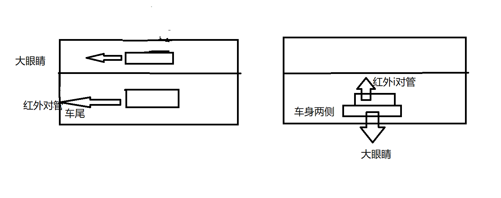

# 雷达擂台车

## 硬件思路

1. 硬件超频，提升电机转速
2. 选择扭矩大的电机
3. 雷达，尽可能换质量更好的雷达
4. 陀螺仪，换精度更高的陀螺仪  （mpu6050->jy61）
5. 上台结构，因为擂台车用雷达，必须雷达能扫描到敌人，尽可能降低车身高度，更换上台结构、
6. 在擂台车在台下时，车上的雷达恰好还能扫描场地。
7. 时刻注意电池的电压，防止航模电池过放。

## 软件思路

1. 陀螺仪初始化，学习如何在运行其他程序时，同时初始化陀螺仪， (陀螺仪初始化很快)

2. 学习f4系统吗，unos系统

3. 以擂台一角建立世界坐标系，时时刻刻确定自身坐标，确定敌人坐标，锁定敌人，绕后，从侧面攻击，如何

   从敌方测面攻击，判断敌人运动方向，提前预判，躲避敌人，规避敌人，调试pid，合适的pid参数，

   车本身的运动学模型，转弯半径（需要学习）
   
4.  建立世界坐标系，如何确定对方坐标，（math.h）可以计算敌方坐标，

5. 在判读敌方时，扫描开始点与结束点，找中间点，以中间点为准，

6. 如何找敌方目标的中间点

7. 如何锁定多个目标，建立多个目标对象，依次打击。

8. 判断对方运动方向，用来判断车是进攻，还是规避。敌方车远离自己，pid准备进攻，靠近自己，选择规避，

   如何规避对方，先判断自身位置，对方运动方向，选择规避方向，规避到安全距离，调头击打，用自己车头去击打对方

9. 击打对方，能判断对方运动方向后，选择对方侧边击打，即对方车运动方向与自身车头方向垂直或其他，对方侧面车身对着我们，最佳击打点，pid快速击打，

10. 守台函数，在车扫描后，敌方由存在变为不存在，判断敌方掉台，自身到与敌方车上次存在的位置相近的位置，车头对着台下，扫描擂台，等待对方出现，出现后马上击打。

## 目前书写顺序

```c
1 解决陀螺仪0漂现象
2 全局变量，全局数组定义使用
3 新的扫描函数  
```

## 多任务调度

```c

```

# 陀螺仪 姿态解算

```c

```

# 软件

1. 看门狗 
2. DMA

# matlab  


## DMA 数据传输 大量数据传输 


# 方便的串口助手


# 硬件

1. 模块化硬件
2. 注意航模电池电量
3. 橡胶垫  垫电池 垫陀螺仪 
4. 注意！不可以用杜邦线
5. 激光模块
6.  在硬件上拉上adc采集电压数据的通道，将电压adc数据返回给单片机，显示4个贴片led，在做板子的时候将贴片led加到板子上层上。
7.  加一个小oled，显示车的状态（台上，台下，台中），目标陀螺仪角度，目标距离，自身的位置坐标
8. 注意擂台车上的橡胶垫，注意减震，减少车身机械噪声对陀螺仪的影响
9.  在芯片板上留串口陀螺仪，mpu6050 的接口，还有 串口显示屏的接口
10.  在做线时，每一根线都要连接牢固，且易拆装，方便后续维修
11. 线要方便整理， 方便拆卸，方便布线。
12. 

# 机械


1. 方便拆装的螺栓，牢固的螺栓，在3d打印件中嵌入螺帽
2. 车本身的重心靠前，
3. 留出方便安装开关的地方，且易开，方便理线的
4. 


# 目前进度 2.26

```c
1 大眼睛没有加上使用   （大眼睛用）（3 ， 4 ，5 ）个大眼睛
2 雷达扫描函数没有好的结果 （重要）
3 雷达车台下
4 用F4用超声波
购买  ：  2个超声波  （已买一个）
车身红外对管  用 4 路 红外循迹板（1mm- 30cm） 防掉台用  其他模块的红外对管
不用判断怎样被拱下台，判断台上和台下2中状态
车身拱到侧面很难被拱下去
灰度有无必要用2个
相对点做差和最近点判断依次扫描，反应慢可以用部分最近点判断
```




# adc

                                                                                                                                                                                                                                                                                                                                                                                                                                                                                                                                                                                                                                                                                                                                                                                                                                                                                                                                                                                                                                                                                                                                                                                                                                                                                                                                                                                                                                                                                                                                                                                                                                                                                                                                                                                                                                                                                                                                                                                                                                                                                                                                                                                                                                                                                                                                                                                                                                                                                                                                                                                                                                                                                                                                                                                                                                                                                                                                                                                                                                                                                                                                                                                                                                                                                                                                                                                                                                                                                                                                                                                                                                                                                                                                                                                                                                                                                                                                                                                                                                                                                                           


# 摄像头


​      现在摄像头中间画出3条线，中间，左侧，右侧，找二维码位置，二维码在中间，前进，二维码在左侧，左转，二维码在右侧，右转，关键找出二维码位置。


```c
			盲区显示距离                 实际盲区距离
雷达           160mm                        130mm

大眼睛          18cm                         18cm
              
在物体堵住大眼睛的时候，大眼睛的数据是不稳定的，最大90，这个跟接触物体的材质有关系。


```

# 台下（3，11）

```
 判断为台下后：
    1  关中断
    2  车往后退2s，目的使车身靠墙，为什么不前进2s，车被拱下的时候，车头朝擂台中，方便直接上台，节省时间
    3 用陀螺仪判断此时车头偏航角 
    4 用车身的红外对管判断自身与墙接触的位置  
    5 用雷达和车身的大眼睛测量此时车身前后左右的距离，做其他判断（两者都有盲区，需要注意）
    
 换边上台：
 
 

```


# 需要购买的东西

```

 1  20个稳压
 2  3卷绝缘胶带
 3  20个红外对管
 4  10个灰度
 5  绝缘胶*2
 6  散热铜片
 7  按键板*3


```

# 外部中断优先级


# DMA


# USRAT2 DMA  JY61  JY901

 [(6条消息) 如何利用DMA通过usart2与usart3将两块mpu6050与STM32F4进行通讯，同时通过usart1将数据print到电脑上（附源码）_xuuyann的博客-CSDN博客](https://blog.csdn.net/qq_26565435/article/details/88807341?ops_request_misc=&request_id=&biz_id=102&utm_term=stm32f4 mpu6050&utm_medium=distribute.pc_search_result.none-task-blog-2~blog~sobaiduweb~default-6-88807341.nonecase&spm=1018.2226.3001.4450) 

# 大眼睛高距离运算

```c
//大眼睛高距离运算


oid filter(void)
{
 register u16 sum=0;
 u8 i=0,j=0;
 for(i=0;i<PER;i++)
 {
  for(j=0;j<NUM;j++)
  {
   sum+=fir[j][i];
  }
  res[i]=sum/20;
  rres[i]=(71850)/(res[i]-7.791);
  if(rres[i]>135)
  {
     rres[i]=135;
  }
  sum=0;j=0;
 }
}

u8 compare(int y)
{ u8 i;
 u8 abc[13];
 u8 abcd=0;
 for( i=0;i<=12;i++)
 {
  if(rres[i]<y)
  {
   abc[i]=1;
  }
  else
  {
   abc[i]=0;
  }
 }
 abc[10]=0;

 for( i=0;i<=12;i++)
 {
  abcd+=abc[i];
 }
 return abcd;
}

float P=0.3,D=2;
float error,last_error,speed;
float PID_realize(float adcl,float adcr)
{
  last_error=error;
  error=adcr-adcl;
  speed=P*error+D*(error-last_error);
  return speed;
}
```


# OPENMV

****

# 锁头

**静止物体锁头**

**动态物体锁头**

重点：如何判断静止的物体还是动态的物体

如果在攻击一个物体时，另一个物体出现在扫描范围内：

优先攻击距离更近的物体


# 捷配


